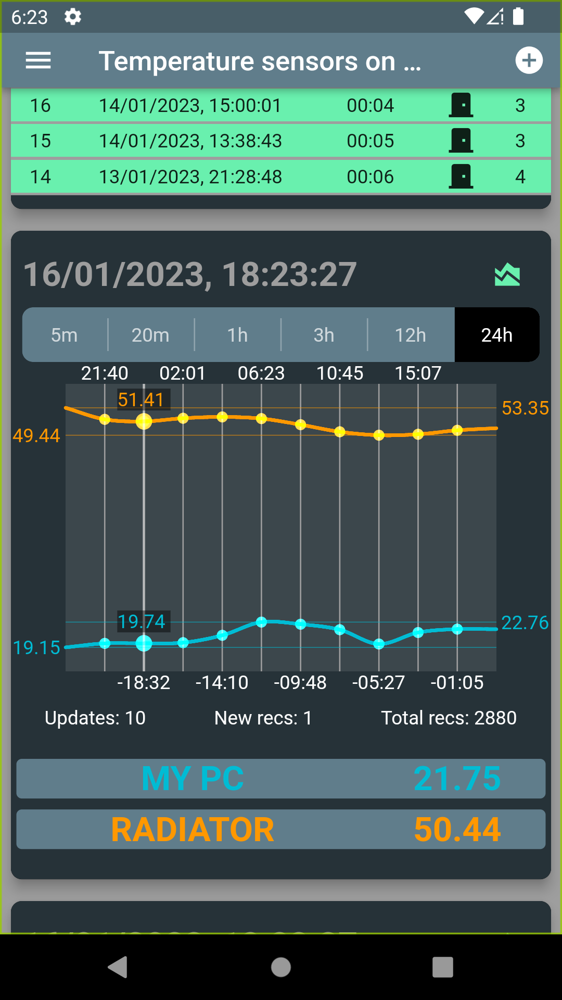

# iots_manager

The mobile cross-platform application for manage the IoT devices of the smart home system.

## 'Smart Home' system scheme

  

## Overview

### At the moment, this 'Smart Home' system supports the following IoT devices:
- [Temperature sensors controller](https://github.com/0kmMobi/IoT_TemperatureSensors);
- ['Door alarm' controller](https://github.com/0kmMobi/IoT_DoorAlarm).

### The 'IoTs Manager' mobile application performs the following functions in the smart home system:
- adding new devices and deleting unused ones for the current authorized user;
- receiving, processing and providing data from devices in the required form;
- device settings management: directly via Wifi and online via Firebase Backend;
- subscriptions to alerts from specific devices.

## Libraries dependencies

### Major dependencies on the following libraries:
- The Firebase products used: [Authentication](https://pub.dev/packages/firebase_auth), [Realtime Database](https://pub.dev/packages/firebase_database), [Cloud Messaging](https://pub.dev/packages/firebase_messaging) for receive alarms push-notifications;
- The App state management and particaly Ephemeral state management based on [flutter_bloc](https://pub.dev/packages/flutter_bloc) library;
- For implementation Dependency injection pattern used (get_it)[https://pub.dev/packages/get_it] librady;
- The [mobile_scanner](https://pub.dev/packages/mobile_scanner) library uses for scanning QR-codes during new IoT-devices adding.

### The following libraries not used now, partially or experimentally used (not in public version):
- Sending messages by [FCM Rest API](https://firebase.google.com/docs/reference/fcm/rest) with 'FCM-token' uses [http](https://pub.dev/packages/http) library;
- The [wifi_iot](https://pub.dev/packages/wifi_iot) library used for provide wifi credentials to new IoT-devices.
- [Firebase cloud storage](https://pub.dev/packages/firebase_storage) for storing photos from an IoT-devices based on The ESP32-Cam controller;

## Screenshots

|   |   |   |
|---|---|---|
||||
||||

 

